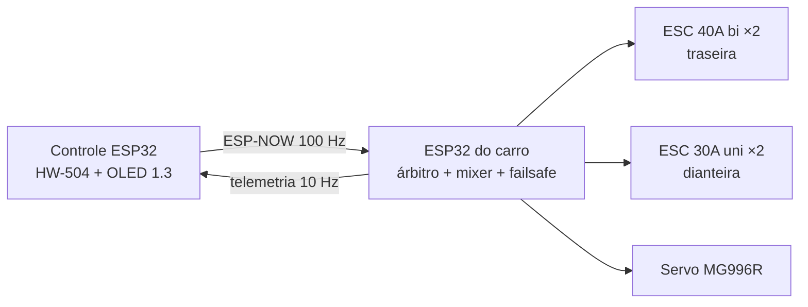
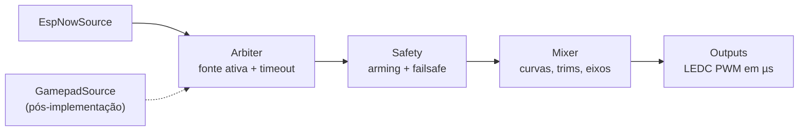

# CustomRC — Plano de reescrita do firmware

Versão viva: https://claude.ai/code/artifact/330d488b-713b-48ed-b494-2caad611b0ed (cópia de 24/09/2026)

## Resumo

A reescrita corta a latência de ~150–200 ms para ~15–25 ms fim a fim. A redução vem de remover `delay()`s e I/O bloqueante do laço, subir a taxa de envio para 100 Hz e aplicar o comando num laço de controle determinístico no carro.

- **Tração:** traseira = 2× ESC 40A bidirecional + motores 2450kv; dianteira = 2× ESC 30A unidirecional + motores 1000kv. Ré e freio só no eixo traseiro.
- **Controle PS4:** pós-implementação. A primeira versão recebe comando só do controle próprio via ESP-NOW; a arquitetura reserva espaço para uma segunda fonte.
- **Reescrita completa:** o código em `legacy/` serve só como referência de funcionalidades (trims, barras no display, ícone de sinal e bateria).

O ESP do carro é o único dono da lógica de segurança: fontes de comando só entregam intenção normalizada; failsafe, arming e mixagem acontecem nele.

## Diagnóstico do código antigo

| Onde | Problema | Efeito |
| --- | --- | --- |
| TX `loop()` | `delay(150)` + redesenho completo do OLED a cada ciclo | ~6 Hz de envio; 150–200 ms de latência |
| TX trims | `delay(130)` bloqueante e `EEPROM.commit()` a cada toque | Trava o envio; desgaste da flash |
| TX trims | `EEPROM.read()` retorna 0–255 (−1 vira 255); leitura antes de `EEPROM.begin()` | Trim negativo corrompido após reboot |
| TX `ResetData()` | `steering = 0` (batente) em vez do centro | Estado inicial com direção toda para um lado |
| TX leitura | `analogRead` direto, 0–180 sem calibração de centro nem deadzone | Carro "anda sozinho" |
| RX `loop()` | `esp_now_send` da telemetria sem intervalo | Milhares de pacotes/s competindo com os comandos |
| RX `loop()` | Display redesenhado a cada volta | I2C bloqueado continuamente |
| RX callback | `memcpy` sem checar `len`, sem assinatura/sequência/CRC | Qualquer pacote ESP-NOW vira comando |
| RX failsafe | Timeout de 1000 ms e neutro 90 para todos os ESCs | ~14 m sem sinal a 50 km/h; ESC unidirecional a ~50% |
| RX `setup()` | Calibração de ESC em todo boot (~9 s) | Risco de disparo |
| Ambos | Cast de callback e MACs fixos | Quebra no core 3.x; trocar placa exige recompilar |
| Ambos | Resolução 0–180 (~5,5 µs/passo) | Aceleração grosseira em 2450kv |

## Hardware e elétrica (decidido)

Esquemas em `docs/fiacao.html`.

- ESP do carro na saída 5 V do multiplexador; C1 470 µF 50 V entre VIN e GND.
- Servo no BEC do ESC traseiro esquerdo; vermelho dos outros 3 ESCs isolado.
- Divisor 100 kΩ / 22 kΩ da bateria (após a chave) para IO36; C2 1 µF no nó. R2, C2 e C1 aterram no GND do ESP.
- HW-504 alimentados em 3,3 V; só pinos ADC1.
- Eixos com kv diferentes (2450 vs 1000): o mixer terá fator dianteira/traseira; falta a relação de engrenagens.
- ESC unidirecional: zero = 1000 µs; em ré/freio a dianteira fica em 1000 µs.
- Testes com rodas fora do chão até o failsafe ser validado.

## Arquitetura alvo

`Command` = `throttle` e `steering` em −1000..1000, `flags` (arm, boost, modo) e `timestamp`. Laço de controle a 200 Hz; callbacks de rádio nunca escrevem em PWM.

### Carro (RX)

| Tarefa | Core | Taxa | Faz |
| --- | --- | --- | --- |
| `control` | 1 | 200 Hz | Arbiter → Safety → Mixer → Outputs |
| `radio` (callbacks) | 0 | por pacote | Valida pacote, grava último comando e estatísticas |
| `telemetry` | 0 | 10 Hz | Bateria, perda de pacotes, RSSI, estado |
| `display` | 0 | 5 Hz | OLED 128×32 opcional |
| `cli` | 0 | sob demanda | Serial: calibração de ESC, config, diagnóstico |

Segurança:

- **Failsafe:** sem comando válido por 200 ms → traseira 1500 µs, dianteira 1000 µs, direção no centro, DESARMADO.
- **Arming:** acelerador em neutro por 500 ms + comando explícito. Após failsafe, rearmar.
- **Boot:** saídas em neutro antes do rádio; sem calibração automática.
- **Bateria baixa:** < 3,5 V/célula sob carga → 50% de potência; < 3,3 V/célula → só devagar.

Mixer:

- Traseira: −1000..1000 → 1000..2000 µs, curva expo e limite de ré.
- Dianteira: só `throttle > 0`, escalado pelo fator dianteira/traseira.
- Direção: trim, endpoints, expo.
- LEDC em µs; 50 Hz inicialmente, testar ESCs a 200–400 Hz.

### Controle (TX)

| Tarefa | Taxa | Faz |
| --- | --- | --- |
| `input` | 200 Hz | ADC com oversampling, calibração, deadzone, trims, debounce sem `delay` |
| `send` | 100 Hz | `ControlPacket` com `vTaskDelayUntil` |
| `display` | 15 Hz | SH1106 a 400 kHz |
| `storage` | sob demanda | Trims/calibração em NVS, grava após 2 s sem mudança |

Organização: PlatformIO com ambientes `car` e `remote` e lib compartilhada `rc_protocol` (pacotes, CRC, mixer), testada no ambiente `native`.

## Protocolo ESP-NOW

| Pacote | Direção | Taxa | Campos | Tamanho |
| --- | --- | --- | --- | --- |
| `ControlPacket` | controle → carro | 100 Hz | `magic` u8, `ver` u8, `seq` u16, `flags` u8, `throttle` i16, `steering` i16, `aux` u8, `crc16` u16 | 13 B |
| `TelemetryPacket` | carro → controle | 10 Hz | `magic`, `ver`, `seq`, `ackSeq` u16, `batt_mV` u16, `rssi` i8, `lossPct` u8, `state` u8, `crc16` | 14 B |
| `PairPacket` | broadcast | pareamento | `magic`, `ver`, `role`, `crc16` | 5 B |

- Structs `packed` com tipos de tamanho fixo, definidas uma vez na lib.
- RX descarta `len`/`magic`/`ver`/CRC inválidos ou `seq` antigo; aceita só o MAC pareado.
- Unicast com ACK de camada MAC; callback de envio vira métrica de link.
- `ackSeq` permite medir RTT real.
- Canal fixo nos dois lados. MACs em `config.h` até o pareamento por botão.
- Opcionais: Long Range (`WIFI_PROTOCOL_LR`), `esp_now_set_peer_rate_config()`, potência máxima.

| Etapa | Antigo | Alvo |
| --- | --- | --- |
| Espera pelo envio | ~75 ms | ~5 ms |
| Ar | 1–3 ms | 1–3 ms |
| Aplicação no carro | no callback | ~2,5 ms |
| Quadro PWM | ~10 ms (50 Hz) | 10 ms; ~2 ms a 250 Hz+ |
| **Total** | **~90–200 ms** | **~15–20 ms** (< 10 ms com PWM rápido) |

## Fases

| Fase | Entrega | Critério de validação |
| --- | --- | --- |
| F0 Elétrica | Alimentação, capacitores, HW-504 em 3,3 V, divisor | Servo travado sem reset; 0 brownout em 10 min |
| F1 Base | PlatformIO, lib `rc_protocol` com testes `native` | Testes passam no PC; firmwares compilam |
| F2 Link | TX 100 Hz, RX responde; perda, RTT, RSSI | Perda < 1% e RTT < 5 ms a 50 m |
| F3 Carro | LEDC, mixer, arming, failsafe, calibração de ESC via CLI | Neutro em ≤ 250 ms ao desligar o controle; não arma fora do neutro |
| F4 Controle | Calibração, deadzone, expo, trims em NVS | Centro 0 ± 10; trims negativos sobrevivem ao reboot |
| F5 Telemetria | Bateria, perda, RSSI, RTT no OLED | Tensão ± 0,1 V do multímetro; 100 Hz mantidos |
| F6 Ajuste | Fator dianteira/traseira, curvas, PWM rápido, LR | Linha reta sem arrasto; latência medida |

Pós-implementação: PS4 via Bluepad32, pareamento por botão, OTA, log de telemetria, controle de tração.

## Pendências

- [ ] Relação de engrenagens de cada eixo e diâmetro das rodas.
- [ ] Quais ESCs têm BEC; o 40A bidirecional vai direto para ré ou exige freio → neutro → ré?
- [ ] ESCs aceitam PWM acima de 50 Hz?
- [ ] Manter o OLED do carro?
- [x] Toolchain para F1: **PlatformIO** com o fork pioarduino, core esp32 **3.3.12**. Ver CLAUDE.md.
- [ ] Fonte de alimentação do controle.
